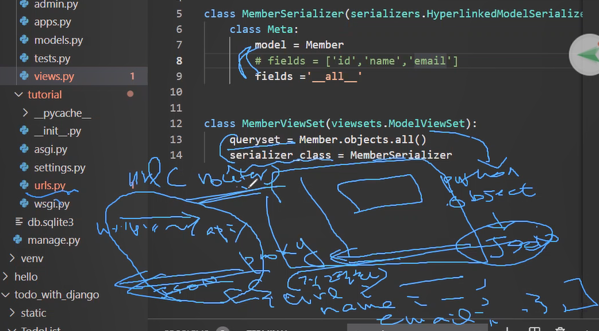

# 개념

## 변화(Django framework->Django REST framework)

기존의 Django framework에서  MVT 패턴을 적용하여 개발할 수 있었다.

Django REST framework의 서버는 데이터를 받아 데이터 처리, 데이터베이스에 반영, 데이터 전달하는 역할만을 수행한다.

T의 화면에 대한 역할은 프론트엔드에 넘겨주게 된다.

그래서 바뀌는 부분은 views(MVC의 controller)이다. 데이터 전달하는 부분만 바뀌면 된다. (views에서 render 가 필요없어진다.)

urls에는 rest framework에서 제공하는 router를 사용해 viewset만 등록시켜주면 됨

# DJANGO REST FRAMEWORK Quickstart

## 0. settings.py 

`installed_apps`에 

- rest_framework
- member(애플리케이션명)

을 추가한다.

### Issue

@ 등록해주어도 import 에러가 나는 경우는 pylint문제이다. 전혀 서버실행에 지장을 주지 않는다.

## 1. models.py

## 2. views.py(바뀌는 부분)

직렬화해서 보낼 데이터를 정의(serializer)해주고 

직렬화할 python 객체를 명시(queryset)하고 직렬화할 class를 명시(serializer_class)한다.(viewset)

serializers.py 를 별도로 작성해주기도 한다.

Django REST framework의 quickstart에서는 model을 작성하지 않고 django-admin에서 기본적으로 제공하는 model을 import하여 사용하고 있다.

`from django.contrib.auth.models import User, Group`

그래서 `makemigrations`  없이 `migrate`를 통해 default model을 반영한다.

## 3. urls.py(바뀌는 부분)

rest framework에서 제공되는 router를 사용해서

매핑해주는 단계

router에 register 메서드로 viewset(serializer포함 됨)을 요청될 REST API URL을 등록해준다.

등록한 URL 요청할 경우 해당 viewset을 응답한다.

### Issue

@ `from member import views` - Import "member" could not be resolved Pylance(reportMissingImports)

- 상위폴더에 있는 views 인데 이렇게 import 하는게 맞나?? __

## pagination	-Skip

## 4. Testing our API

`python manage.py runserver`

### Issue
Error: [WinError 10013] 액세스 권한에 의해 숨겨진 소켓에 액세스를 시도했습니다

# 정리

django framework와 상관없는 게 아님

제공하는 범위가 화면까지인지, 데이터까지 인지로 django framework, django rest framework로 구분되는 것임

실제 데이터는 json 형태로 넘어간다.

기존의 django framework에서 view select 하는 부분은 django rest framework에서 serializer와 viewset작성으로 바뀌게 된다.

 

1. url로 넘어온 요청이 있다.

2. 서버 안에는 proxy 서버와 python object들이 존재한다.

3. python object를 json으로 바꿔주는 과정이 필요하다.

4. 그리고 json 데이터를 proxy를 통해 전달하려면 객체 직렬화 과정이 필요하다.

5. router는 url 요청에 부합하는 등록해놓은 view에 맞게 전달한다.

   

rest가 관여하는 부분은 여기까지이고 나머지는 django framework와 똑같다.

커스터마이징하기 위해 api reference를 한다.

serializer의 다양한 종류(API Guide에서 bold로 명시된)를 확인해본다.

최상위 클래스인 serializer를 사용하면 생성자부터 작성해서 번거로울 수 있다.

그래서 최상위 클래스를 상속받는 HyperlinkedModelSerializer를 활용한다.

이로써 Meta데이터만 명시하면 사용할 수 있다.

model 속성을 사용하지 않는 serializer의 경우에는 init 메서드를 통해 직접 모델을 정의하는 커스터마이징을 하여 사용한다.

데이터가 json이 아니면 xml 을 serializer를 구현해야한다.

rest니까 json을 썼는데 xml형태로 제공하는 API가 있으면 사용하면 된다.

이처럼  개발자들이 반복적으로 하는 작업의 번거로움을 덜어주기 위해서 반복되는 코드와 라이브러리를 API형태로 만들어진다.

# QUESTION

1. 우리는 proxy에 대해서 신경쓸 필요가 없나?
2. router는 django framework에서 view select하는 부분이 데이터 모델 select하는 부분으로 바꼈다고 이해해도 무방한가?